  

# 👋 HI, I'M LAURA

**Junior AI/ML developer** focused on building practical applications using **Python, Machine Learning and Generative AI**.

I have hands-on experience developing projects involving **NLP, Computer Vision, predictive modelling, recommendation systems** and **AI-powered applications**.

🌍 Spanish (native) · English (C1) · Based in the Canary Islands (Spain) · Open to remote

🔭 Currently building a **logistics toolkit application**.

📫 Looking for opportunities as a **Junior AI/ML Engineer**, **Python Developer** or **Junior Data/AI Specialist**.

---

## 🧠 About Me

- 🚀 Python developer focused on Artificial Intelligence
- 🤖 Experience with Machine Learning and NLP
- 👁️ Computer Vision 
- 🧠 Generative AI and LLM 
- 🌐 Flask applications and REST APIs
- 🗄️ SQL and SQLite
- 📊 Data analysis and model evaluation
- 🔧 Git and GitHub

---

## 🛠️ Tech Stack

| **Programming** | Python · SQL |
| **Machine Learning** | Scikit-learn · Pandas · NumPy |
| **AI** | NLP · Computer Vision · YOLO · LLMs · Generative AI |
| **Web & APIs** | Flask · REST APIs |
| **Databases** | SQLite |
| **Tools** | Git · GitHub · PyCharm |

---

## 🎓 Education

**Artificial Intelligence Specialization** — Tokio School  
*Sep 2025 – Sep 2026*

**Python Programming** — Tokio School  
*Sep 2024 – May 2026*

---

## 📫 Contact

